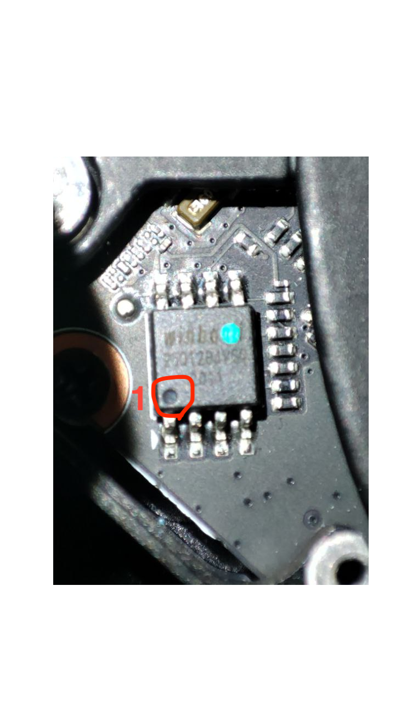

## BIOS settings

|Firmware|Version|
|---|---|
|System BIOS|1.04|
|EC FW|1.01|
|MCU FW|1.00.00.00|

### Basic settings

`Advanced`>`Thunderbolt(TM) Configuration`

	Security Level: No Security

`Chipset`>`SATA And RST Configuration`
	
	SATA Mode Selection: AHCI
`Security`>`Secure Boot`
	
	Secure Boot: Disabled
`Boot`
	
	`Fast Boot`: Disabled
`Boot`>`CSM Configuration`
	
	CSM Support: Disabled

### Unlocked Settings

`CPU - Power Management Control`>`View/Configure CPU Lock Options`

	CFG Lock; Disabled
	Overclocking Lock: Disabled

`Chipset`>`System Agent (SA) Configuration`
	
	VT-d: Disabled

`Chipset`>`System Agent (SA) Configuration`>`Graphics Configuration`
	
	DVMT Pre-Allocated: 64MB
	DVMT Total Gfx Mem: MAX

`Advanced`>`CPU Configuration`

	Software Guard Extensions (SGX)

## Modding the BIOS

The BIOS has been modded by using:
- CH341A v1.7 programmer (3.3V) 
- [Aptio V UEFI Editor](https://github.com/BoringBoredom/UEFI-Editor)
- [AsProgrammer](https://github.com/nofeletru/UsbAsp-flash)

### Chip's location

The BIOS chip [WINBOND W25Q128JV](https://www.digchip.com/datasheets/parts/datasheet/2/523/W25Q128JV.php) is located just above the dGPU:


ATTENTION: The point 1 of the chip is located on the other side of the blue dot.



### Changes from the original BIOS file

```
========== Section_PE32_image_Setup_Setup.sct ==========

Unsuppressed 0x28762
Unsuppressed 0x29AB3
Unsuppressed 0x32D05
Unsuppressed 0x33FB1
```