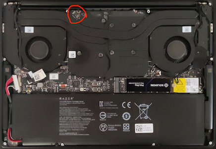
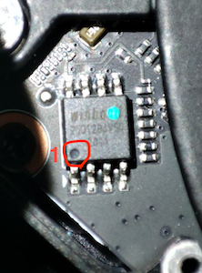

## BIOS

|Firmware|Version|
|---|---|
|System BIOS|1.04|
|EC FW|1.01|
|MCU FW|1.00.00.00|

### Basic settings

```
Advanced>Thunderbolt(TM) Configuration
	Security Level: No Security
Chipset>SATA And RST Configuration
	SATA Mode Selection: AHCI
Security>Secure Boot
	Secure Boot: Disabled
Boot
	Fast Boot: Disabled
Boot>CSM Configuration
	CSM Support: Disabled
```

### Unlocked Settings

```
Advanced>CPU Configuration
	Software Guard Extensions (SGX): Disabled
Advanced>Power & Performance>CPU - Power Management Control>CPU Lock Configuration
	CFG Lock; Disabled
	Overclocking Lock: Disabled
Chipset>System Agent (SA) Configuration
	VT-d: Disabled
Chipset>System Agent (SA) Configuration>Graphics Configuration
	Primary Display: IGFX
	DVMT Pre-Allocated: 64M
	DVMT Total Gfx Mem: MAX
```

## Modding the BIOS

The BIOS has been modded by using:
- CH341A v1.7 programmer (3.3V) 
- [Aptio V UEFI Editor](https://github.com/BoringBoredom/UEFI-Editor)
- [AsProgrammer](https://github.com/nofeletru/UsbAsp-flash)

### Chip location

The BIOS chip [WINBOND W25Q128JV](https://www.digchip.com/datasheets/parts/datasheet/2/523/W25Q128JV.php) is located just above the dGPU:



ATTENTION: The point 1 of the chip is located on the opposite side of the blue dot.



### Changes from the original BIOS file


========== Section_PE32_image_Setup_Setup.sct ==========

Unsuppressed 0x28762
Unsuppressed 0x29AB3
Unsuppressed 0x32D05
Unsuppressed 0x33FB1


## Notes

If you have an unlocked BIOS, you can disable the following options in the config.plist file:

```
Kernel>Quirks
	AppleXcpmCfgLock: NO (CFG-Lock)
	DisableIoMapper: NO (VT-d)
UEFI>Quirks
	ReleaseUsbOwnership: NO (EHCI/XHCI Handoff)
```